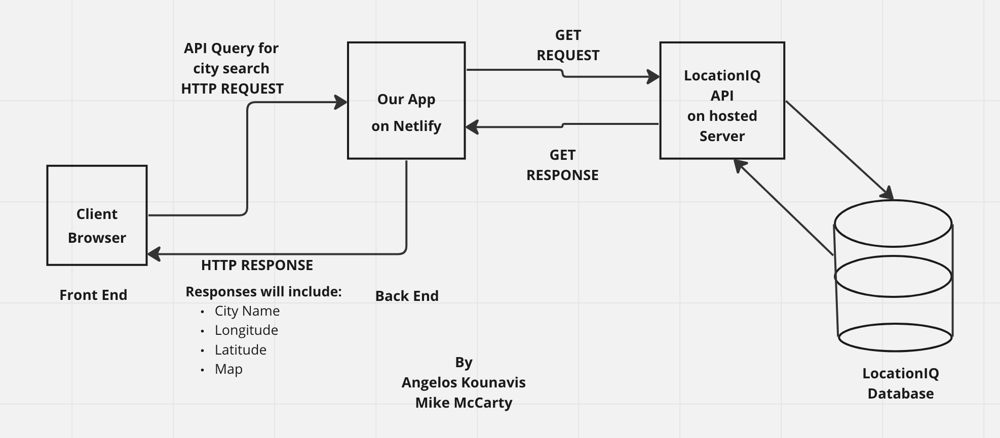
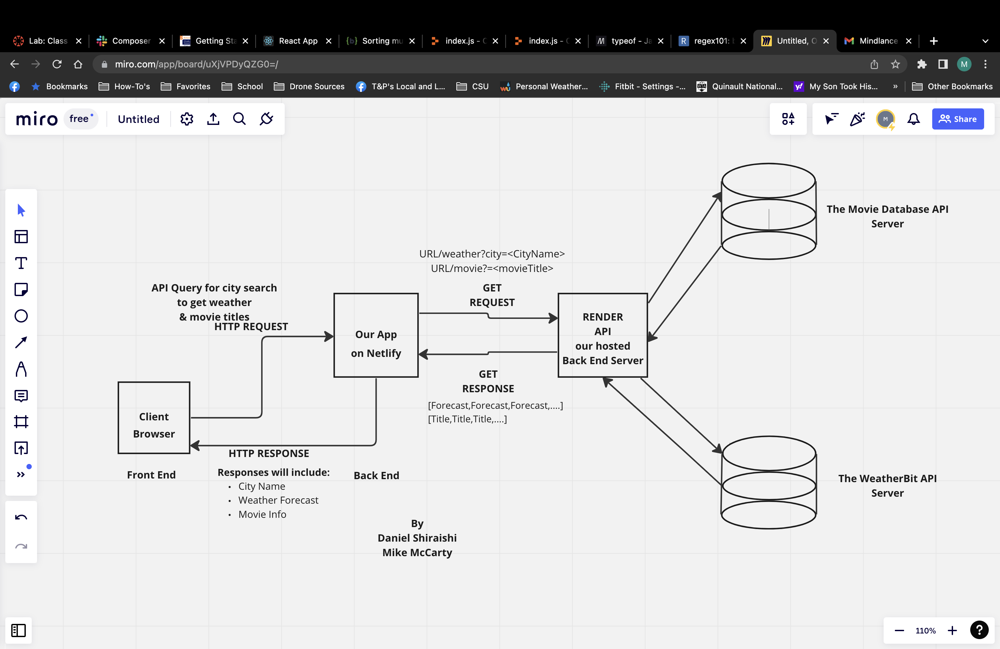

# City-Explorer

(ver. 1.0)

## Author - Mike McCarty

This project is the second JS React app Using APIs and produces a map with longitude and latitude in a modal

## Lab 06/07

## Problem Domain

14/15/16 November - Took three days to get lab 6 done but finally accomplished.
17 November - Weather data is now functioning in a modal for each city on the front end with appropriate error handling. The map location is not functioning as it is commented out and not a requirement for lab 7 but the map data & latitude and longitude is still being called from LocationIQ.
19 November - Shifted weather data to be retrieved from Weather Bit versus using the weather.json file.

## Instructions

- Complete your Feature Tasks for the day.
- Create a Pull Request (PR) back to the main branch of your repository.
- Submit your assignment as a link to your PR, and a comment describing how much time you spent on the lab.

## Architectures

### Lab 6 Architecture

### Lab 8 Architecture

## Resources

- [deployment](https://facebook.github.io/create-react-app/docs/deployment)

- [Getting Started](https://reactjs.org/docs/getting-started.html)

- [React Bootstrap](https://react-bootstrap.github.io/)

## Change Log

- 2:40pm 14 November Initial repository built on local developer's machine and on Github
- 3:40pm 16 November Completed todo lists for lab 6
- 10:30am 19 November started to build in Weather Bit data retrieval
- 3:26opm 19 November successfully completed Weather Bit data retrieval

## Comments & Reflections Lab 6

### Number and name of feature: Feature #1 - Display images

Estimate of time needed to complete: 120 minutes
Start time: 1:40pm
Finish time: 3:35pm
Actual time needed to complete:  1hour 55 minutes

### Number and name of feature: Feature #2 - Locations

Estimate of time needed to complete: 120 minutes
Start time: 4:05pm
Finish time: 7:55am (the next day)
Actual time needed to complete: roughly 7 hours

### Number and name of feature: Feature 3 - Map

Estimate of time needed to complete: 7 hours
Start time: 7:00am
Finish time: 2:30pm
Actual time needed to complete: roughly 4 hours

### Number and name of feature: Feature 4 - Errors

Estimate of time needed to complete: 120 minutes
Start time: 2:35pm
Finish time: 3:40pm
Actual time needed to complete: 70 minutes

## Comments & Reflections Lab 8

### Number and name of feature: Feature #1 - Weather (live)

Estimate of time needed to complete: 10 hours
Start time: 10:30am
Finish time: 3:30pm
Actual time needed to complete: 5 hours
